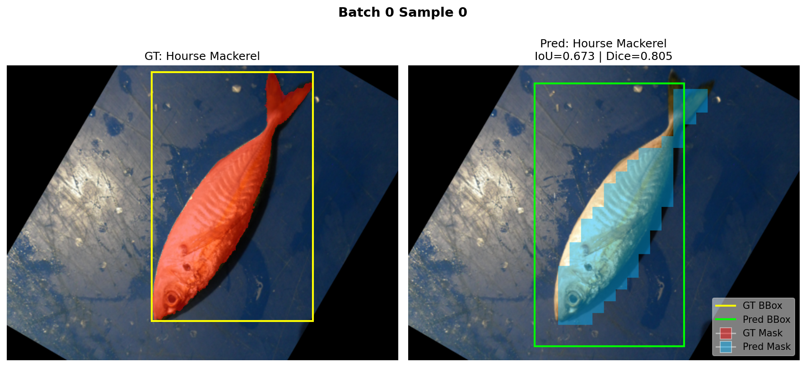

# Fish Segmentation Task
## Introduction

This project is a detailed and comprehensive tutorial of Definition of each component🤗, and also a very useful tutorial for using pretrained model in huggingFace🤗. It includes 2 models, all of these models have **full code implement** + **pdf-tutorial** :  

1. Self-defined Model using `ResNet-50` backbone, processor of `Detr` and customized Multi-task Head and loss to make ***classification, boundary box prediction*** and ***segmentation*** (24.7M parameters).
2. Fine-Turned Model using `detr-resnet-50-panoptic` to do the same task (42.9M parameters). 

Above 2 full-trained models can be found at 🤗:
1. https://huggingface.co/FriedParrot/fish-segmentation-model
2. https://huggingface.co/FriedParrot/fish-segmentation-simple

Both models are trained by [A Large Scale Fish Dataset](https://www.kaggle.com/datasets/crowww/a-large-scale-fish-dataset). 

Note that for the convenience, I also made a copy version for this dataset available on [hugging face](https://huggingface.co/datasets/FriedParrot/a-large-scale-fish-dataset).

> [!note]  
> Actually at start I just wanted to fine-tune the DETR model for this task, but I made it using the resnet-50 backbone to do it while studying components  (I admit it complicated the problem😅). So finally I implemented both😊. 
>
> The first approach may seem more complicated, but it provides a comprehensive
> view of the different components available in Hugging Face. By exploring these details, the guide becomes more in-depth and accessible for newcomers(including myself) who want to understand the full workflow and flexibility of the library, also it's friendly for those who used to making models on pytorch ecosystem.
> 
> For those who looking for fine-tune the DETR model directly, or just using pretrained-model, you can also find fine-tuning code for DETR at `Fish_Simple` Folder. 


## Project Structure

- **Fish_Pretrain** : The first model which use resnet-50 backbone and all customized model and multi-task head. 
- **Fish_Finetune** : The second model which using fine-tuned detr-resnet-50-panoptic model to train on fish dataset. 
- **tutorials** : All pdf tutorials for both models. 

## How to run the code 
### 1. Install the requirements 
if you have cuda12.8, you can install the requirements by: 
```bash
pip install -r requirements.txt
```
or you can install requirements according to your cuda version and requirements.txt file. 

### 2. login you hugging face account and also make sure you have correct kagglehub token  

```bash
hf auth login 
```

For kagglehub token, you can find it at `https://www.kaggle.com/<your_account>/account` and then create a new API token. After that, put the `kaggle.json` file into `~/.kaggle/` folder.  

### 3. Train the model 
run the `Fish_Pretrain > model_building.py` to train the first model. 
run the `Fish_Finetune > model_building.py` to train the second model.  

Note you may change the model upload `repo_id` and `private_mode` at before calling `backup_model_to_hub()` function.

run `Fish_Pretrain > model_evaluation.py` or `Fish_Finetune > model_evaluation.py` to evaluate the model and get picture result.


## Example of inference 

###  Example of First model 

>  since the first model decrease mask resolution, so the mask is not very accurate: 



Since this is not a model for very high accuracy training task, I didn't evaluate its accuracy very in detail. 

Actually, the classification performance of first model is really bad at classification, segmentation and bounding box prediction. 

(Even if the result looks reasonable, Actually the classification accuracy is only 63% on random set, but you can modify the loss weight of classification for better result).
 
### Example of Second model
